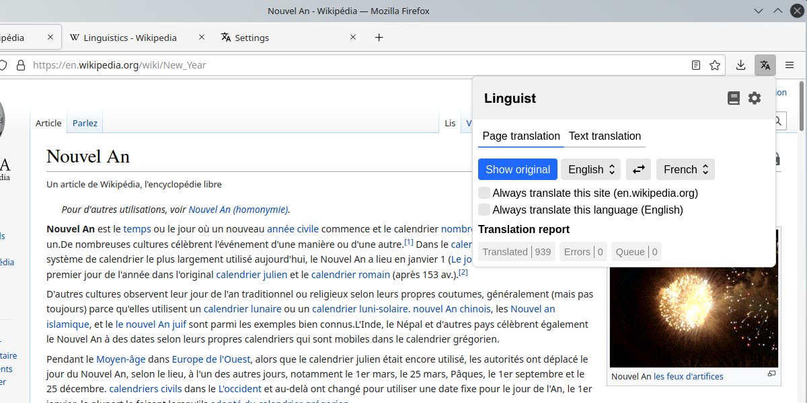
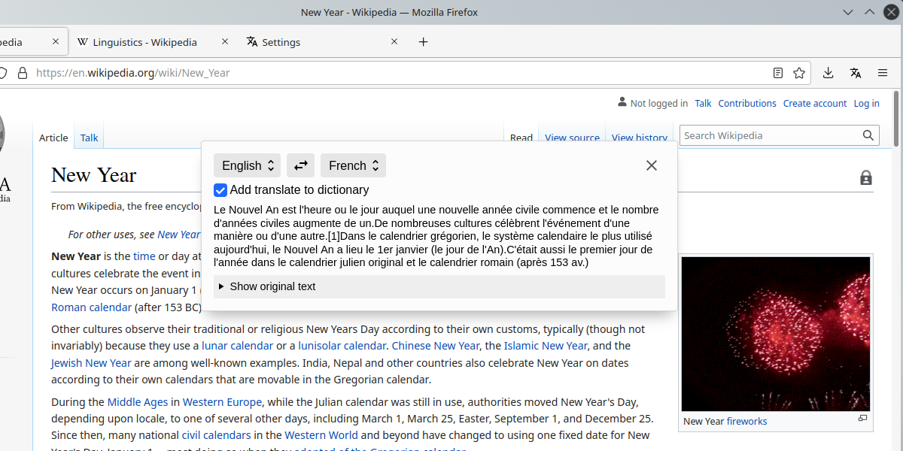
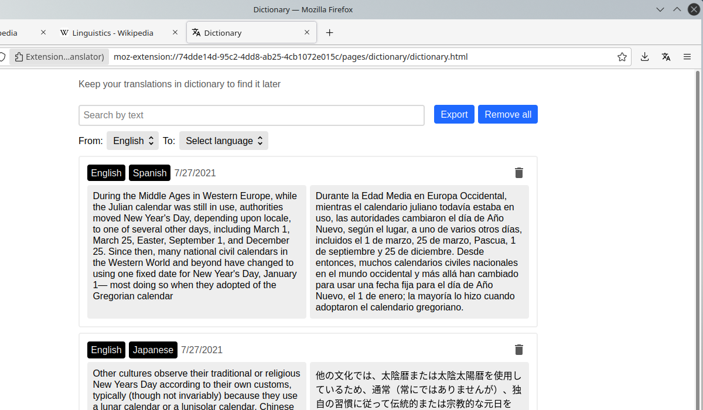

Linguist is a powerful browser extension for translate pages and text, which are ready to replace your favorite translate service.

Its may use any translate service and builds on it great user interface with many features.

# Installation

Get addon for your browser

<!--  -->
<!--  -->

If you have other browser, check out [GitHub Releases page](https://github.com/vitonsky/linguist/releases), download package and install it manually in development mode.

# Features

Linguist very convenient for use

- Real time translate pages without reloading
- Translate selection text segments
- Translate manually input text
- Dictionary for save important translates
- Support all translate services (even your own service)

Supported translators out of box:

- Google
- Yandex
- Bing

Also you can use your own custom service (in development).

You control all your data and can download your personal dictionary and other data in any time.

Linguist care about your traffic and use cache, then if you translate page or phrase once, you can do it again any time, even without internet connection. Cache may be disable if you want for translate private data.

# Why it better than online translate services?

When you use translate service, you can't translate pages, which require authorization, because online services can translate only public pages. Also, online service collect your personal data, track you and give you only one translator, but linguist may use any translate service, even local translate service which translate your data on your PC without internet.

# Why it better than other extensions for translate?

It's free, open source, support all translate services and it is not collect your personal data.

This extension allow you not only translate text on pages, but translate all as you wish and keep important translates for you, it's like your personal translator in internet.

It is for make life little more comfortable, for all users of internet

# Screenshots

# Development

See [ROADMAP.md](./ROADMAP.md) for getting know development plans.

You may improve Linguist, [make issue](https://github.com/translate-tools/linguist/issues/new) and suggest features or tell about bugs unknown for us.

Help us translate Linguist to your language. Read the [internationalization guide](https://developer.mozilla.org/en-US/docs/Mozilla/Add-ons/WebExtensions/Internationalization) and make pull request.

# Support

Do you like Linguist? Tell about it to your friends and colleagues, let's make it popular.

You is don't like Linguist? [Make issue](https://github.com/translate-tools/linguist/issues/new) and suggest improvements.
