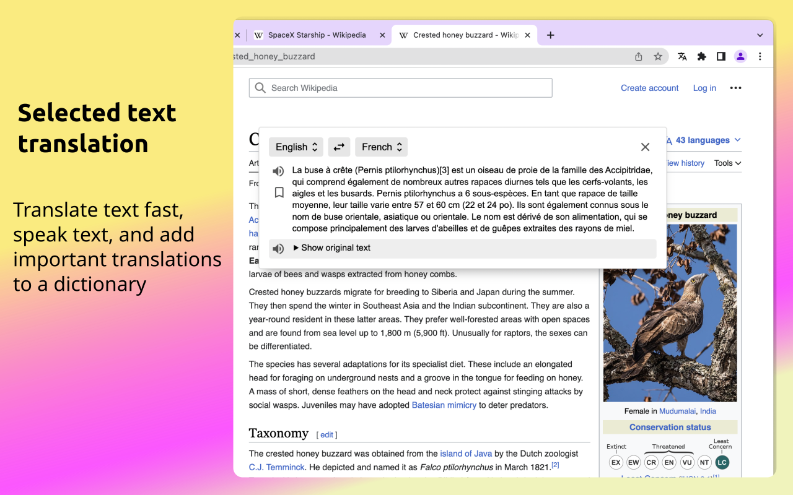
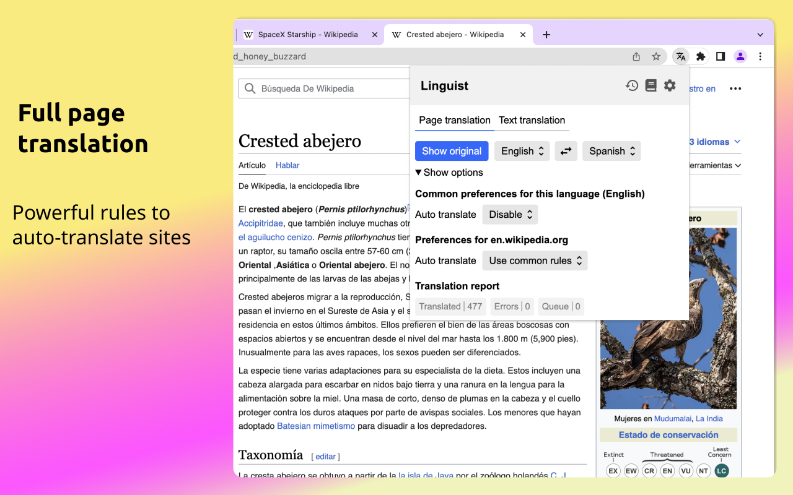
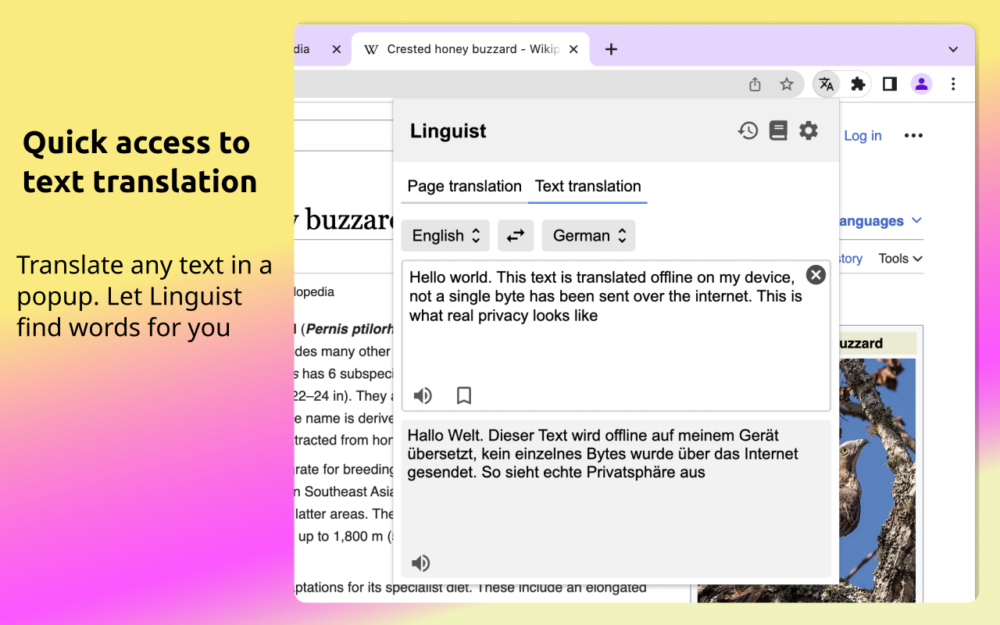
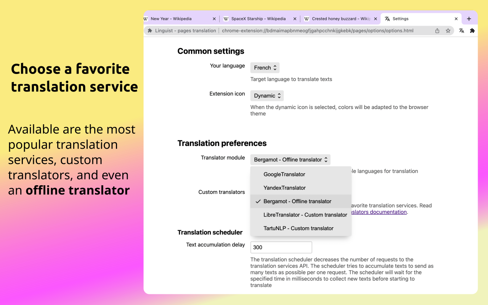
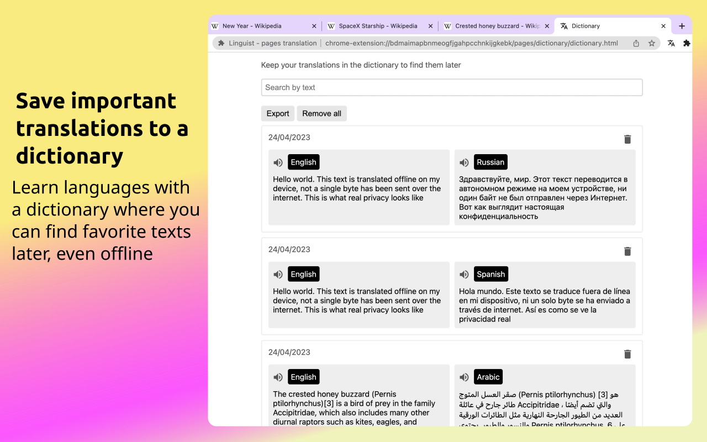

Linguist is a powerful browser extension that is ready to replace your favorite translation service.

Translate web pages, highlighted text, Netflix subtitles, private messages, speak the translated text, and save important translations to your personal dictionary to learn words in 130 languages.

# Why Linguist?

Unlike other browser extensions, Linguist is not just a wrapper over the Google Translator Widget; it's a full-featured and independent translation system. This is why with Linguist you can be private and translate texts offline on your device and use any translation service, [even your own](./docs/CustomTranslator.md) like ChatGPT. See a [custom translators list](https://github.com/translate-tools/linguist-translators) to find bindings for the most popular translation services.

Linguist is free, open-source, respects your privacy, and does not collect your personal data.

# Features

Most important features
- Modular translators system
	- You can use any translation service like Google, Yandex, Bing, DeepL, ChatGPT, etc.
	- [Custom translators](./docs/CustomTranslator.md): you can use your own translator module
	- Offline translation. With embedded [Bergamot translator](https://github.com/browsermt/bergamot-translator), you can translate texts right on your device. Keep your privacy
- All-in-one translation solution
	- Full-page translation with flexible auto-translation configuration
	- Highlighted text translation
	- Translate any text input
- Dictionary with saved translations
- Translations history, to remember recently translated words
- Text-to-speech (TTS)

# Installation

Get the addon for your browser:

 

<!--  -->

If you have another browser, check out the [GitHub Releases page](https://github.com/vitonsky/linguist/releases). Download the package and install it manually in development mode.

## Android

<!-- Text partly copied from https://github.com/ajayyy/SponsorBlock/wiki/Android -->

This addon can be used on mobile browsers with [Firefox Nightly](https://play.google.com/store/apps/details?id=org.mozilla.fenix) (Recommended), or with any chromium browser that supports extensions.

To try it on Firefox, you have to add the [Linguist add-on](https://addons.mozilla.org/addon/linguist-translator/) to a [custom add-on collection](https://www.ghacks.net/2020/10/01/you-can-now-install-any-add-on-in-firefox-nightly-for-android-but-it-is-complicated/) and use this collection to install the extension.

To try it on a chromium browser, download the normal extension for Chrome.

# Screenshots

# Development

See [development docs](./docs/Development.md) to get info on how to build and debug.

You can improve Linguist, [make issues](https://github.com/translate-tools/linguist/issues/new) and suggest features or report bugs.

Contribute to Linguist, see the ["help wanted" label](https://github.com/translate-tools/linguist/labels/help%20wanted) to find hot issues.

# Support

Do you like Linguist? Tell your friends and colleagues about it. Let's make it popular.

Do you need a feature or don't like Linguist? [Make an issue](https://github.com/translate-tools/linguist/issues/new) and suggest improvements.

Help us translate Linguist into your language. Read the [internationalization guide](https://developer.mozilla.org/en-US/docs/Mozilla/Add-ons/WebExtensions/Internationalization) and make a pull request.

# Donations

Linguist is completely free and open-source, and it does not collect any user data to sell. You can support the project with your donations to help Linguist maintain its independence and high quality.

- Bitcoin: bc1q2krassq0sa2aphkx37zn374lfjnthr5frm6s7y
- Ethereum: 0x2463d84F46c131886CaE457412e8B6eaBc0b91a7

# Supporters

