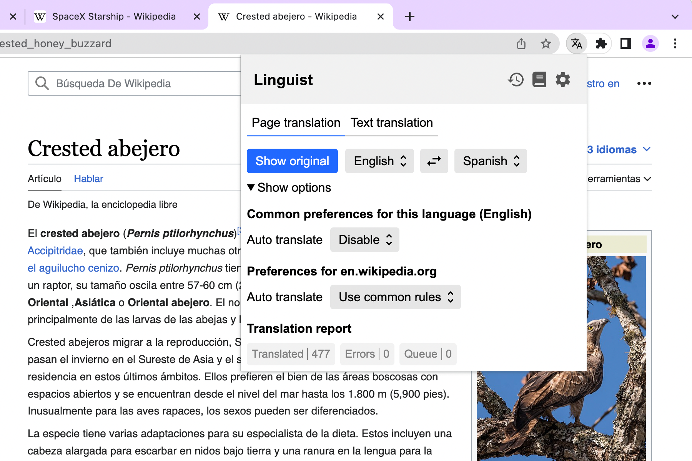
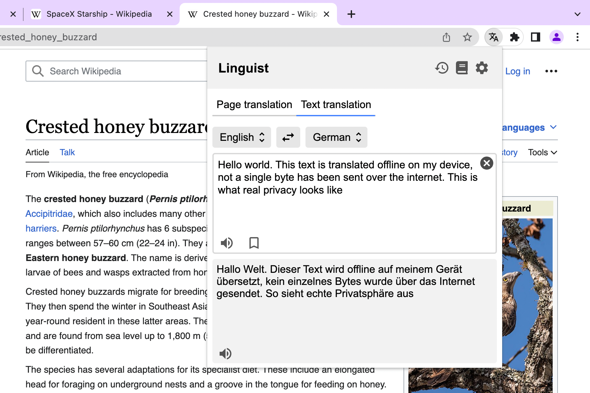
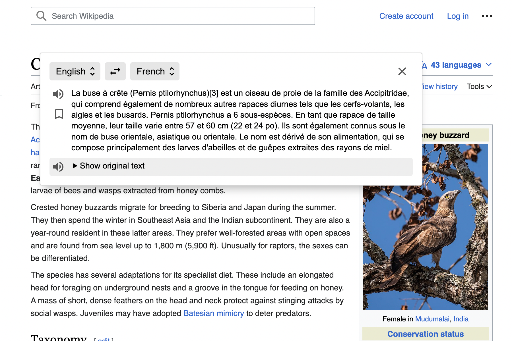
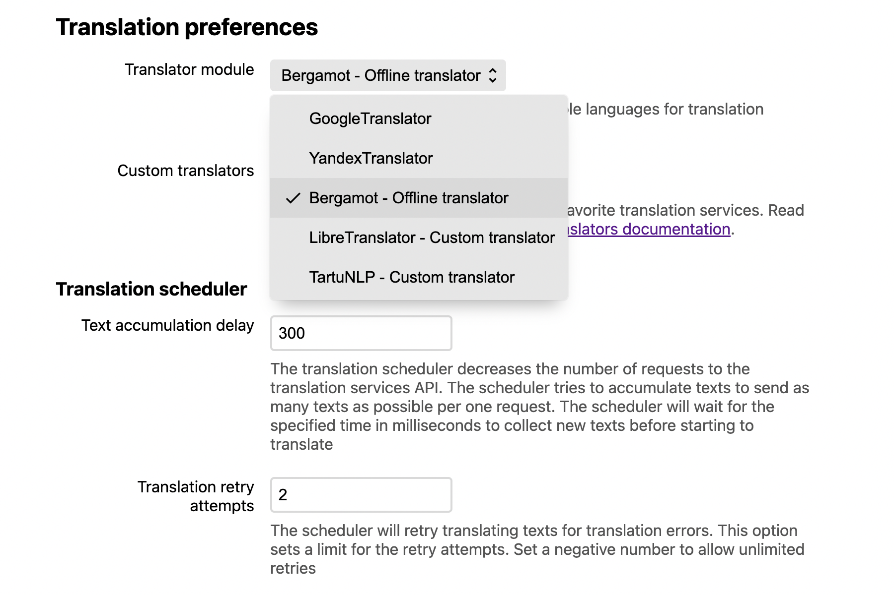

Linguist is a powerful browser extension built to replace commercial translation services — private, fast, and under your control.

Translate web pages, highlighted text, subtitles (including Netflix), and private messages; hear translations via TTS; and save entries to a personal dictionary. Supports 130 languages.

# Why Linguist?

Linguist is a standalone translation system — not a thin wrapper around a commercial widget. Translate privately and offline on your device, or plug in any backend you choose (including your own; see [Custom translators](https://linguister.io/docs/CustomTranslator)). See a [custom translators list](https://github.com/translate-tools/linguist-translators) for popular bindings.

Linguist is free, open-source, and collects no personal data.

# Features

Most important features
- Modular translators system
	- You can use any translation service like Google, Yandex, Bing, DeepL, ChatGPT, etc.
	- [Custom translators](https://linguister.io/docs/CustomTranslator): you can use your own translator module
	- Offline translation. With embedded [Bergamot translator](https://github.com/browsermt/bergamot-translator), you can translate texts right on your device. Keep your privacy
- All-in-one translation solution
	- Full-page translation with flexible auto-translation configuration
	- Highlighted text translation
	- Translate any text input
- Dictionary with saved translations
- Translations history, to remember recently translated words
- Text-to-speech (TTS)

# Installation

Get the addon for your browser:

 

<!--  -->

If you have another browser, check out the [GitHub Releases page](https://github.com/vitonsky/linguist/releases). Download the package and install it manually in development mode.

## Android

<!-- Text partly copied from https://github.com/ajayyy/SponsorBlock/wiki/Android -->

This addon can be used on mobile browsers with [Firefox Nightly](https://play.google.com/store/apps/details?id=org.mozilla.fenix) (Recommended), or with any chromium browser that supports extensions.

To try it on Firefox, you have to add the [Linguist add-on](https://addons.mozilla.org/addon/linguist-translator/) to a [custom add-on collection](https://www.ghacks.net/2020/10/01/you-can-now-install-any-add-on-in-firefox-nightly-for-android-but-it-is-complicated/) and use this collection to install the extension.

To try it on a chromium browser, download the normal extension for Chrome.

# Screenshots

See more info on https://linguister.io

# Development

See [development docs](./docs/Development.md) to get info on how to build and debug.

Contribute to Linguist: file issues, suggest features, and submit pull requests. See the ["help wanted" label](https://github.com/translate-tools/linguist/labels/help%20wanted) for high-impact tasks.

# Donations

Linguist is free, open-source, and collects no user data. If you rely on Linguist, back its independence and development.

How you can support:
- Star the repository to increase visibility and attract contributors
- File issues and suggest improvements: [new issue](https://github.com/translate-tools/linguist/issues/new)
- Help translate the UI (see the internationalization guide) and send a pull request
- Contribute artwork or UX design
- Reproduce and test unconfirmed bug reports: [recheck](https://github.com/translate-tools/linguist/labels/recheck)
- Fix bugs or implement features (TypeScript experience helpful)

Donate to vote with your money: prioritize fixes, commission features, or speed up important work. After donating, send transaction details and the issue/feature reference to [support@linguister.io](mailto:support@linguister.io) or add them in the issue comments. For significant donations, we will begin work on your request immediately.

- Monero (XMR): 861w7WuFGecR7SMpuf7GX9BBUgGJb1Xdx8z5pCpMrKY2ZeZAzS3mwZeQeJGV5RPpu35fr5dURSm587ewpHYGzNuGKGroQnD
- Bitcoin (BTC): bc1q2krassq0sa2aphkx37zn374lfjnthr5frm6s7y
- Ethereum (ETH), Tether USDT (ERC-20): 0x2463d84F46c131886CaE457412e8B6eaBc0b91a7
- Tron (TRC), Tether USDT (TRC-20): TQezzyzkfMCPJRdnYxNXrUfPj3s7kDeMBL

# Supporters

