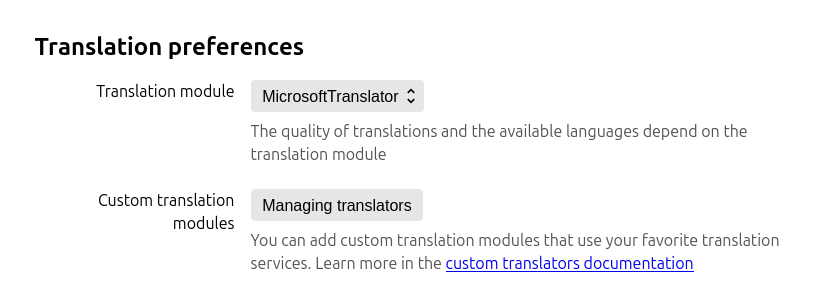
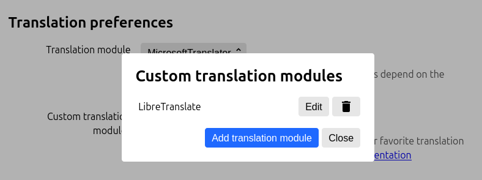
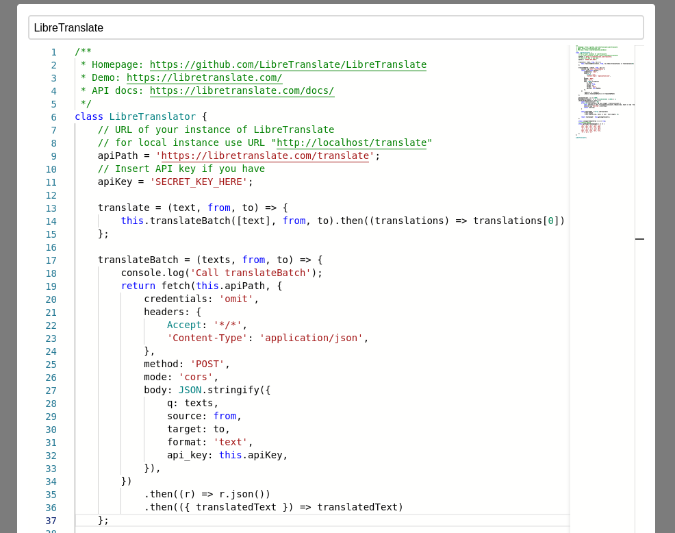

Linguist is a highly customizable solution for translation in browser. By default you may choose one of embedded translators, you may even use offline translator for privacy sensitive texts.

Although, Linguist is not limit you with an embedded translators, you may integrate literally any third party service with a Linguist. ChatGPT, DeepL, Ollama or anything else, you may integrate it all as a [custom translator](/docs/CustomTranslator).

This feature is especially useful for those who involved in research work and uses Linguist intensively to translate content on many foreign languages, when standard translators may give not enough good translation quality, or translation must be fine tuned.

<!-- truncate -->

## What is custom translator?

Custom translator is a Javascript code that implements `Translator` interface to fetch translations for requested source text and language to a target language.

You may implement translator yourself if you can program, see [custom translator interface](/docs/CustomTranslator) that must be implemented.

Alternatively, you may find code of translator in [public translators list](https://github.com/translate-tools/linguist-translators). If there no translator for service you want to have, feel free to [make issue](https://github.com/translate-tools/linguist-translators/issues/new/choose) about it.

## Usage

To add custom translator follow next steps

- Go to settings page and click "Manage translators" 
- Click button to add new translator 
- Insert code of custom translator 

## Security

Technically, a custom translator code is run in a browser extension context, so **you must never paste untrusted code**.

Actually, code is sandboxed via iframe with no origin context, so there are no access to browser extension API. The iframe context is patched to transparently proxify a [`fetch` API](https://developer.mozilla.org/en-US/docs/Web/API/Fetch_API), so any requests will be forwarded through browser extension context, to make able request any resources with no CORS limitations.

This design is needed to unlock you fetch any API, even those who set strict CORS rules, or deployed locally. You may just call any API with no hassle.

Sandbox must prevent any potential ability to run custom code in a browser extension context. So this code must not be able to read or modify content on web pages or anything like this.

However, **it is potentially possible to make authenticated requests** to any services, so *if you will use untrusted code, hackers may steal your data or money on bank account*.