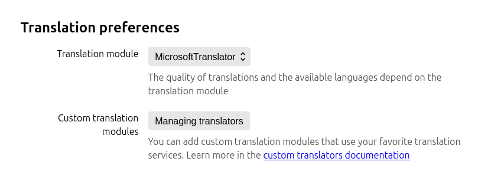
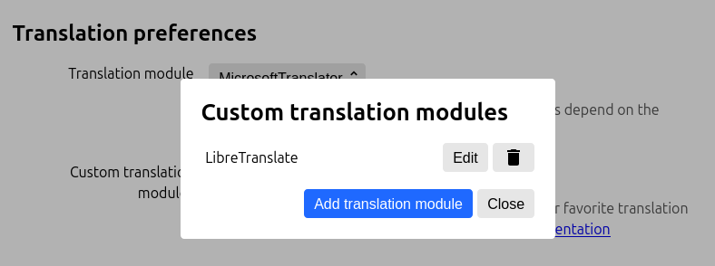

Linguist is a highly customizable solution for translation in the browser. By default, you may choose one of the embedded translators, you may even use an offline translator for privacy-sensitive texts.

Although Linguist does not limit you to embedded translators, you may integrate literally any third-party service with Linguist. ChatGPT, DeepL, Ollama, or anything else, you may integrate it all as a [custom translator](/docs/CustomTranslator).

This feature is especially useful for those involved in research work and using Linguist intensively to translate content in many foreign languages, when standard translators may not provide good enough translation quality, or when translation must be fine-tuned.

<!-- truncate -->

## What is a custom translator?

A custom translator is a Javascript code that implements the `Translator` interface to fetch translations for requested source text and language to a target language.

You may implement the translator yourself if you can program, see [custom translator interface](/docs/CustomTranslator) that must be implemented.

Alternatively, you may find the code of the translator in the [public translators list](https://github.com/translate-tools/linguist-translators). If there is no translator for the service you want to have, feel free to [make an issue](https://github.com/translate-tools/linguist-translators/issues/new/choose) about it.

## Usage

To add a custom translator, follow these steps

- Go to the settings page and click "Manage translators" 
- Click the button to add a new translator 
- Insert the code of the custom translator 

## Security

Technically, a custom translator code runs in a browser extension context, so **you must never paste untrusted code**.

Actually, the code is sandboxed via an iframe with no origin context, so there is no access to the browser extension API. The iframe context is patched to transparently proxify a [`fetch` API](https://developer.mozilla.org/en-US/docs/Web/API/Fetch_API), so any requests will be forwarded through the browser extension context, to make it possible to request any resources with no CORS limitations.

This design is needed to allow you to fetch any API, even those that set strict CORS rules, or are deployed locally. You may just call any API with no hassle.

The sandbox must prevent any potential ability to run custom code in a browser extension context. So this code must not be able to read or modify content on web pages or anything like this.

However, **it is potentially possible to make authenticated requests** to any services, so *if you use untrusted code, hackers may steal your data or money from your bank account*.